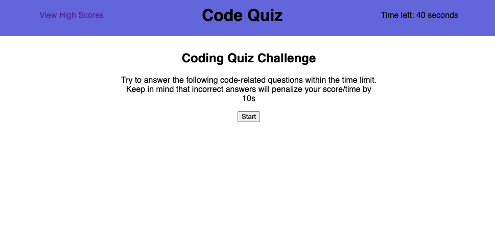

# 04 Web APIs: Code Quiz

This is a web application that displays a multiple choice quiz on simple javascript knowledge. I built it from scratch with the following requirements: 

* It must have a start button, that when pressed, starts a timer
* Wrong answers subtract time from the clock
* If all questions are complete or the timer runs out, then a game over screen is shown
* Past scores and user initials must save between sessions
* The interface must be responsive to screen size

In this project, I used vanilla javascript, media queries, event listeners, timers, simple objects, and for loops. I revealed and hid elements using javascript to alter CSS properties, as well as explored the DOM. 

here is a link to the deployed application on GitHub Pages: https://brownj47.github.io/code-quiz/

